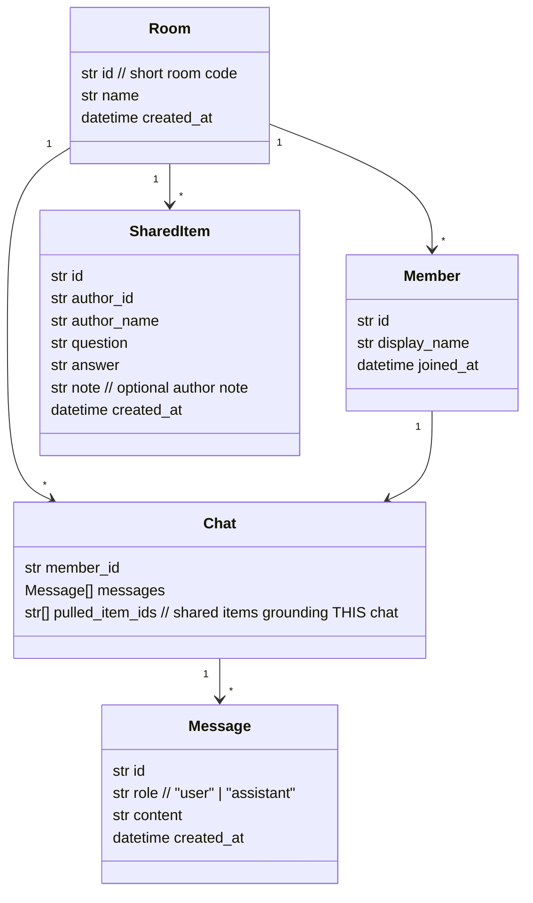

# Copilot friends— Architecture


> "GitHub for chatting." Everyone gets a private LLM chat (their branch). Push the good
> Q&A into a shared room context (main). Pull from the shared context to ground your own
> next question.


---


## 1. Concept


| Git analogy | Huddle |
|---|---|
| Repository | **Room** (a meeting room, joined by code) |
| Branch | **Private chat** (one per person) |
| Commit / push | **Push** a Q&A from my chat into the shared context |
| Pull / merge | **Pull** a shared item into my chat so the LLM uses it |
| `main` | **Shared context** (the room's collective knowledge) |


A **context item** is one question + answer pair, plus an optional author note
("this is what it said when I asked it X").


---


## 2. Components


```mermaid
flowchart TB
   subgraph Browser["Frontend (plain HTML/JS)"]
     UI[Room view: my chat | shared context | members]
   end
   subgraph Server["Backend (FastAPI)"]
     API[REST API]
     STORE[(In-memory store)]
     LLM[OpenAI provider]
   end
   UI -- fetch JSON --> API
   API --> STORE
   API -- chat completion --> LLM
   LLM --> API
```


- **Frontend**: single-page `index.html` + vanilla JS. Refresh-on-load (no websockets for MVP).
- **Backend**: FastAPI, in-memory store (resets on restart), OpenAI for completions.
- **No auth**: pick a display name + room code to join.


---


## 3. Data model





**Grounding rule:** when a member sends a new message, the backend prepends any
`pulled_item_ids` (their question/answer/note) into the LLM system prompt so the
model answers with the team's shared knowledge in mind.


---


## 4. API surface


| Method | Path | Purpose |
|---|---|---|
| `POST` | `/api/rooms` | Create a room → `{ room_id }` |
| `POST` | `/api/rooms/{room_id}/join` | Join with `display_name` → `{ member_id }` |
| `GET`  | `/api/rooms/{room_id}` | Room state: members + shared context |
| `GET`  | `/api/rooms/{room_id}/chats/{member_id}` | My private chat (messages + pulled items) |
| `POST` | `/api/rooms/{room_id}/chats/{member_id}/messages` | Send message → LLM reply (grounded by pulled items) |
| `POST` | `/api/rooms/{room_id}/shared` | **Push** a Q&A (+ note) into shared context |
| `POST` | `/api/rooms/{room_id}/chats/{member_id}/pull` | **Pull** a shared item into my chat |
| `PUT`  | `/api/rooms/{room_id}/shared/{item_id}` | Edit a shared item |
| `DELETE` | `/api/rooms/{room_id}/shared/{item_id}` | Remove a shared item |


---


## 5. Repo layout


```
backend/
 main.py             FastAPI app + routes
 models.py           Pydantic request/response + domain models
 store.py            In-memory store (rooms, chats, shared context)
 llm.py              OpenAI provider wrapper (grounding prompt assembly)
 config.py           Settings loaded from env
 requirements.txt
 .env.example
frontend/
 index.html          Single-page room UI
 css/styles.css
 js/api.js           Thin fetch wrapper over the REST API
 js/app.js           UI state + render (refresh-on-load)
ARCHITECTURE.md
```


---


## 6. Out of scope (MVP)


- Real-time sync (websockets, presence, typing) — refresh-on-load only.
- Accounts / persistence — in-memory, name + room code.
- Permissions — anyone can edit/remove any shared item.
- Mirroring real VS Code Copilot sessions — we call OpenAI directly.
